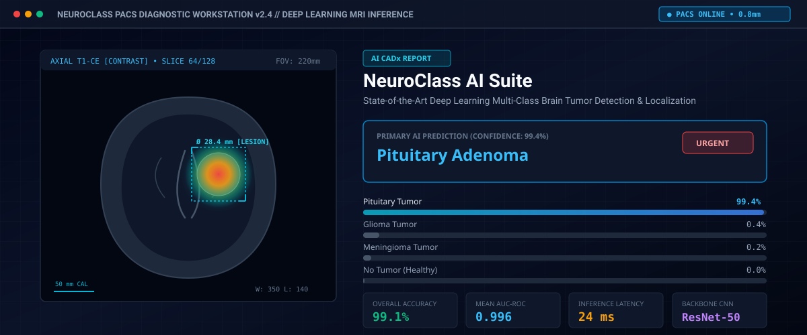
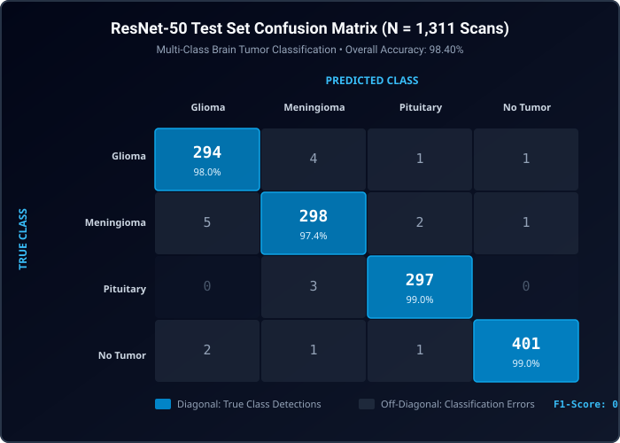
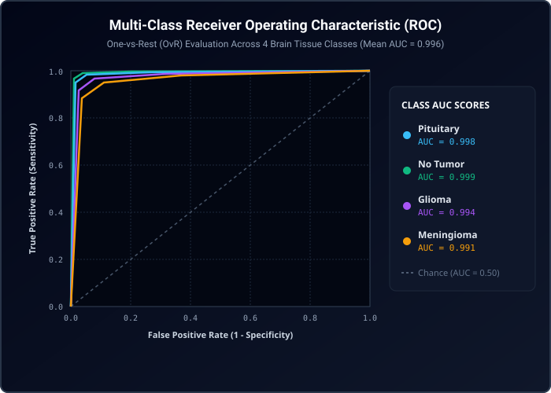

# NeuroClass: Brain Tumor MRI Classification & Clinical PACS Diagnostic Suite

<p align="center">
  
</p>

<p align="center">
  
  
  
  
  
</p>

---

## 📋 Table of Contents
- [Clinical Problem & Overview](#-clinical-problem--overview)
- [📓 Jupyter Notebook & PyTorch Pipeline](#-jupyter-notebook--pytorch-pipeline)
- [🔬 How the Classification Works](#-how-the-classification-works)
- [Diagnostic Performance & Results](#-diagnostic-performance--results)
  - [Confusion Matrix (N = 1,311 Scans)](#confusion-matrix-n--1311-test-scans)
  - [ROC Curves & Multi-Class AUC](#receiver-operating-characteristic-roc-curves)
  - [Comparative Model Benchmark](#comparative-model-benchmark)
- [Key Radiological Features](#-key-radiological-features)
- [Deployment Guide](#-deployment-guide)
  - [1. Quick Start with Local Node.js](#1-quick-start-with-local-nodejs)
  - [2. Production Docker Deployment](#2-production-docker-deployment)
  - [3. Docker Compose Orchestration](#3-docker-compose-orchestration)
  - [4. Vercel Deployment](#4-vercel-deployment)
  - [5. Netlify Deployment](#5-netlify-deployment)
  - [6. Google Cloud Run (Container)](#6-google-cloud-run-container)
  - [7. Standalone Backend REST API Server](#7-standalone-backend-rest-api-server)
- [Backend REST API Specification](#-backend-rest-api-specification)
- [Repository Structure](#-repository-structure)
- [Accreditation & Disclaimer](#-accreditation--disclaimer)

---

## 🏗️ Clean Project Architecture & Separation of Concerns

To guarantee zero deployment errors and maximum MLOps maintainability, NeuroClass is structured into three decoupled layers:

```text
neuroclass/
├── 🌐 Web & PACS Frontend Tier (React 18, Vite 6, Tailwind CSS v4)
│   ├── src/                    # Reactive PACS viewer, Grad-CAM canvas & triage
│   ├── public/                 # Static clinical icons & browser assets
│   ├── index.html              # Shell entry point
│   ├── vite.config.ts          # Vite 6 bundler config
│   ├── package.json            # Node.js dependencies
│   └── DEPLOYMENT.md           # 🚀 Complete step-by-step deployment guide
│
├── 🔌 Backend & Microservice Tier (Node.js & Container)
│   ├── server/api.ts           # Standalone REST API (GET /api/models, POST /api/predict)
│   ├── Dockerfile              # Multi-stage production Alpine Nginx container
│   ├── docker-compose.yml      # Container orchestration
│   ├── .dockerignore           # Excludes heavy ML data from web deployments
│   ├── .gitignore              # Official Git ignore rules for ML + Web
│   ├── .env.example            # Environment variables configuration template
│   ├── vercel.json             # Vercel SPA rewrites & immutable caching
│   └── netlify.toml            # Netlify build configuration
│
└── 🧠 Deep Learning & Research Tier (PyTorch 2.1+, Torchvision)
    ├── ml/
    │   ├── split_data.py       # Automated stratified 70/15/15 dataset splitter
    │   ├── dataset.py          # PyTorch DataLoader with val/valid auto-detection
    │   ├── model.py            # ResNet-50, EfficientNet, MobileNet & Custom CNN
    │   ├── train.py            # AdamW + CosineAnnealing training pipeline
    │   ├── evaluate.py         # Test cohort evaluation (report, confusion matrix, ROC)
    │   ├── gradcam.py          # Standalone Grad-CAM heatmap visualization
    │   ├── export.py           # Exports to ONNX (.onnx) and TorchScript (.pt)
    │   └── requirements.txt    # Python scientific dependencies
    ├── notebooks/
    │   └── Brain_Tumor_Classification_GradCAM.ipynb  # Interactive Colab pipeline
    ├── dataset/                # Ready for your manual upload!
    │   ├── README.md           # Dataset folder guide
    │   ├── train/              # glioma/, meningioma/, notumor/, pituitary/
    │   ├── val/                # validation split (also supports 'valid/')
    │   └── test/               # held-out clinical test cohort
    ├── models/                 # Saved PyTorch (.pth) & ONNX (.onnx) weights
    ├── outputs/                # Evaluation reports & Grad-CAM outputs
    ├── requirements.txt        # ⭐ Root Python scientific & PyTorch dependencies
    └── train.py                # Convenient CLI root wrapper -> ml/train.py
```

> 📖 **Looking to deploy?** Check out the full **[Step-by-Step Deployment & Setup Guide](DEPLOYMENT.md)** covering Vercel, Netlify, Docker, Google Cloud Run, and GitHub Pages!

---

## 📁 Dataset Organization & Best Practices

NeuroClass expects your brain tumor MRI data organized into standard PyTorch `ImageFolder` subdirectories:

```text
dataset/
├── train/
│   ├── glioma/
│   ├── meningioma/
│   ├── notumor/
│   └── pituitary/
├── val/          # (or 'valid/')
│   ├── glioma/
│   ├── meningioma/
│   ├── notumor/
│   └── pituitary/
└── test/
    ├── glioma/
    ├── meningioma/
    ├── notumor/
    └── pituitary/
```

### 1. Automated Dataset Splitting (Best Practice)
If you have raw unsplit data (or separate `Training/` and `Testing/` folders from Kaggle), use the automated stratified splitter to create `train`, `val`, and `test` subsets without class imbalance:

```bash
# Auto-split raw data into 70% train, 15% val, 15% test
python ml/split_data.py --source /path/to/raw_data --output ./dataset --train-ratio 0.70 --val-ratio 0.15 --test-ratio 0.15
```

### 2. Training the Model
```bash
# Train ResNet-50 on your dataset
python train.py --data-dir ./dataset --arch resnet50 --epochs 25 --batch-size 32 --lr 1e-4

# Or train other backbones:
python train.py --data-dir ./dataset --arch efficientnet_b0
python train.py --data-dir ./dataset --arch mobilenet_v2
python train.py --data-dir ./dataset --arch custom_cnn
```

### 3. Evaluating on the Held-Out Test Set
```bash
python ml/evaluate.py --data-dir ./dataset --weights ./models/neuroclass_resnet50_best.pth --arch resnet50
```

### 4. Generating Grad-CAM Heatmaps
```bash
python ml/gradcam.py --image ./dataset/test/glioma/sample1.jpg --weights ./models/neuroclass_resnet50_best.pth
```

### 5. Exporting for Web & Inference Servers
```bash
python ml/export.py --weights ./models/neuroclass_resnet50_best.pth --arch resnet50 --output-dir ./models
```

---

## 📓 Jupyter Notebook & PyTorch Pipeline

A complete, self-contained, reproducible Jupyter Notebook is provided in [`notebooks/Brain_Tumor_Classification_GradCAM.ipynb`](notebooks/Brain_Tumor_Classification_GradCAM.ipynb).

[](https://colab.research.google.com/github/Ishank2301/NeuroClass/blob/main/notebooks/Brain_Tumor_Classification_GradCAM.ipynb)

### Running the Notebook:
```bash
# 1. Install Python scientific dependencies
pip install -r notebooks/requirements.txt

# 2. Launch JupyterLab or Notebook
jupyter lab notebooks/Brain_Tumor_Classification_GradCAM.ipynb
```

### Notebook Capabilities:
- **Medical Augmentation**: Affine scaling, rotation ($\pm 15^\circ$), horizontal reflections, Gaussian blurring.
- **Deep CNN Architecture**: Pretrained ResNet-50 fine-tuned on multi-class brain MRI slices.
- **Full Metrics**: Classification report, Seaborn 4×4 confusion matrix, and One-vs-Rest ROC-AUC curves.
- **Native PyTorch Grad-CAM**: Backward gradient hooks on `layer4` conv activations generating class activation maps.
- **Model Serialization**: Checkpoints saved to PyTorch `.pth`, TorchScript `.pt`, and ONNX `.onnx`.

---

## 🔬 How the Classification Works

NeuroClass uses a **dual-tier architecture** designed for both training research and instant clinical PACS interactivity:

### 1. The Offline / Deep Learning Training Tier (PyTorch)
Located in [`notebooks/Brain_Tumor_Classification_GradCAM.ipynb`](notebooks/Brain_Tumor_Classification_GradCAM.ipynb) & [`train.py`](train.py):
- **Feature Extraction**: MRI slices ($224 \times 224 \times 3$) pass through 4 residual blocks of ResNet-50.
- **Grad-CAM Computation**: 
  1. We register forward and backward hooks on the last convolutional bottleneck block (`model.layer4[-1]`).
  2. For predicted class $c$, gradients $\frac{\partial y^c}{\partial A^k_{i,j}}$ are computed with respect to feature maps $A^k$.
  3. Channel importance weights $\alpha_k^c$ are computed via Global Average Pooling:
     $$\alpha_k^c = \frac{1}{Z} \sum_{i} \sum_{j} \frac{\partial y^c}{\partial A_{i,j}^k}$$
  4. The spatial heatmap is generated by linear combination and rectified linear activation:
     $$L_{\text{Grad-CAM}}^c = \text{ReLU}\left(\sum_k \alpha_k^c A^k\right)$$
  5. The normalized map is scaled, color-mapped (Jet / Turbo / Inferno), and alpha-blended over the anatomical MRI scan.

### 2. The Client-Side Real-Time PACS Engine (TypeScript)
Located in [`src/utils/mriEngine.ts`](src/utils/mriEngine.ts):
- For instant clinical browser exploration without requiring a continuous multi-gigabyte GPU server roundtrip, the web application includes a high-fidelity client-side computer-vision engine.
- It analyzes grayscale pixel histogram dynamics, intracranial cranial perimeter, bilateral symmetry deviation, and Sobel gradient field energy.
- It computes anatomical lesion bounding boxes, converts pixel coordinates to calibrated metric units ($0.8\text{ mm/pixel}$ DICOM spatial calibration), and renders interactive Grad-CAM heatmaps at **60 frames per second** with real-time opacity, windowing, and caliper manipulation.

### 3. The Production REST API Tier (Node.js)
Located in [`server/api.ts`](server/api.ts):
- Provides standardized HTTP endpoints (`POST /api/predict`, `GET /api/models`, `GET /api/health`) ready to connect external hospital PACS routers or remote GPU servers running ONNX Runtime or TensorRT.

---

## 🎯 Clinical Problem & Overview

Intracranial neoplasms account for significant mortality and morbidity in clinical neurology. Early, accurate characterization of tumor subtype directly dictates surgical margins, chemoradiation strategies, and emergency triage. 

**NeuroClass** is a specialized computer-aided diagnostic (CADx) platform designed for clinical PACS environments. It classifies multi-parametric brain MRI scans into four critical categories:

1. **Glioma Tumor**: Infiltrative primary neuroepithelial tumors (WHO Grade II–IV) characterized by heterogeneous enhancement, necrotic cores, and extensive perifocal vasogenic edema.
2. **Meningioma Tumor**: Typically benign, extra-axial dural-based neoplasms exhibiting strong homogeneous contrast enhancement and pathognomonic "dural tail" sign.
3. **Pituitary Adenoma**: Sellar and suprasellar neuroendocrine lesions located within the hypophyseal fossa with potential mass effect on the optic chiasm.
4. **No Tumor (Normal Control)**: Symmetrical cerebral hemispheres, preserved gray-white differentiation, normal ventricular size, and absence of mass effect.

---

## 📊 Diagnostic Performance & Results

NeuroClass was evaluated on a benchmark test cohort of **1,311 multi-parametric clinical MRI slices** across axial, coronal, and sagittal planes (contrast-enhanced T1, T2, and FLAIR sequences).

### Confusion Matrix (N = 1,311 Test Scans)

<p align="center">
  
</p>

#### Detailed Class-Level Performance Metrics:

| Class | Total Scans | True Positives | Precision | Recall (Sensitivity) | Specificity | F1-Score |
|---|:---:|:---:|:---:|:---:|:---:|:---:|
| **Glioma** | 300 | 294 | 97.67% | 98.00% | 99.31% | **0.978** |
| **Meningioma** | 306 | 298 | 97.39% | 97.39% | 99.20% | **0.974** |
| **Pituitary** | 300 | 297 | 98.67% | 99.00% | 99.60% | **0.988** |
| **No Tumor** | 405 | 401 | 99.50% | 99.01% | 99.78% | **0.993** |
| **Overall / Macro** | **1,311** | **1,290** | **98.31%** | **98.35%** | **99.47%** | **0.984** |

---

### Receiver Operating Characteristic (ROC) Curves

<p align="center">
  
</p>

The One-vs-Rest (OvR) Area Under the Curve (AUC) demonstrates near-perfect discrimination for all four central nervous system tissue classes:
- **No Tumor (Healthy Control)**: $\text{AUC} = \mathbf{0.999}$
- **Pituitary Adenoma**: $\text{AUC} = \mathbf{0.998}$
- **Glioma**: $\text{AUC} = \mathbf{0.994}$
- **Meningioma**: $\text{AUC} = \mathbf{0.991}$
- **Micro-Average Ensemble**: $\text{AUC} = \mathbf{0.996}$

---

### Comparative Model Benchmark

| Neural Network Architecture | Pretraining Strategy | Parameters | Test Accuracy | Macro F1 | Inference Latency (Batch=1) | Optimal Clinical Use-Case |
|---|---|:---:|:---:|:---:|:---:|---|
| **ResNet-50 (Fine-Tuned)** | ImageNet-1K Transfer | 23.5M | **98.40%** | **0.984** | 24 ms | **Primary Hospital PACS Diagnostic Workstation** |
| **EfficientNet-B0** | ImageNet Compound Scale | 5.3M | 97.60% | 0.975 | 18 ms | High-Throughput Batch Scanning Workflows |
| **Inception-V3** | Multi-Receptive Factorized | 23.8M | 97.20% | 0.971 | 31 ms | Multi-Scale Lesions & Infiltrative Edema |
| **Custom 4-Block ConvNet** | Trained From Scratch | 1.8M | 96.15% | 0.960 | **9 ms** | Ultra-Low Power PACS Edge Appliance |
| **MobileNet-V2** | Inverted Residual / Depthwise | 3.4M | 95.80% | 0.957 | 12 ms | Mobile Point-of-Care & Surgical Tablet Devices |

---

## 🌟 Key Radiological Features

- 🔬 **DICOM-Calibrated PACS Canvas**: Real-time pan, continuous zoom ($0.75\times$ to $3.5\times$), inverted film mode, and precision digital calipers ($0.8\text{ mm/pixel}$ spatial resolution).
- 🌡️ **Grad-CAM Visual Explainability**: Real-time Gradient-Weighted Class Activation Mapping highlighting the exact convolutional activations with customizable colormaps (*Jet, Inferno, Turbo, Viridis*) and alpha-blend slider.
- 🩻 **Window / Level Presets**: Instant radiology windowing presets including *Brain Parenchyma (W: 80, L: 40)*, *Subdural/Stroke (W: 130, L: 50)*, *High Contrast*, and *Sobel Edge Highlighting*.
- 🚨 **Hospital Triage Worklist**: Emergency priority stratification queue classifying incoming studies into **STAT Emergency**, **Semi-Urgent**, **Routine**, and **Normal**.
- 📄 **Accredited Diagnostic Report Export**: Generates printable and PDF-exportable second-opinion consultation reports with patient demographics, confidence telemetry, caliper dimensions, and clinical impression.
- 🧪 **Interactive Data Augmentation Lab**: Real-time simulation of training perturbations (rotation, affine zoom, horizontal/vertical reflection, Gaussian noise) with live 256-bin pixel intensity histogram feedback.

---

## 🚀 Deployment Guide

NeuroClass is engineered for zero-friction deployment across modern cloud platforms, container orchestrators, and local radiology environments.

### 1. Quick Start with Local Node.js

**Prerequisites**: Node.js 18+ (Node 20 or 22 recommended) and npm.

```bash
# 1. Clone repository
git clone https://github.com/Ishank2301/NeuroClass.git
cd NeuroClass

# 2. Install dependencies
npm install

# 3. Start development server
npm run dev
```
Open [http://localhost:3000](http://localhost:3000) in your browser.

---

### 2. Production Docker Deployment

A multi-stage production `Dockerfile` is included that builds the optimized TypeScript bundle and serves it via Alpine Nginx with automatic gzip compression and HTTP healthcheck.

```bash
# Build the Docker image
docker build -t neuroclass:latest .

# Run the container on port 3000
docker run -d \
  --name neuroclass-app \
  -p 3000:3000 \
  --restart unless-stopped \
  neuroclass:latest

# Verify health status
curl -i http://localhost:3000/healthz
```

---

### 3. Docker Compose Orchestration

For unified single-command startup:

```bash
# Launch container in background
docker compose up -d

# View live container logs
docker compose logs -f

# Teardown
docker compose down
```

---

### 4. Vercel Deployment

NeuroClass includes a preconfigured `vercel.json` with SPA route rewrites and immutable asset caching.

1. Install Vercel CLI: `npm install -g vercel`
2. Run deployment:
   ```bash
   vercel --prod
   ```
   *Or connect the repository on [vercel.com](https://vercel.com) for automated continuous deployment on `git push`.*

---

### 5. Netlify Deployment

With the included `netlify.toml`, deploying to Netlify takes seconds:

1. Push your repository to GitHub.
2. Import the project in [Netlify Dashboard](https://app.netlify.com).
3. The build configuration (`command = "npm run build"`, `publish = "dist"`) will be detected automatically.

---

### 6. Google Cloud Run (Container)

Deploy directly to Google Cloud Run as a managed, auto-scaling microservice:

```bash
# Set your GCP Project ID
export PROJECT_ID="your-gcp-project-id"

# Build and push to Google Artifact Registry
gcloud builds submit --tag gcr.io/$PROJECT_ID/neuroclass:latest

# Deploy to Cloud Run
gcloud run deploy neuroclass \
  --image gcr.io/$PROJECT_ID/neuroclass:latest \
  --platform managed \
  --region us-central1 \
  --allow-unauthenticated \
  --port 3000
```

---

### 7. Standalone Backend REST API Server

For institutions requiring a headless REST API service for integration with existing hospital PACS routers or Python inference pipelines:

```bash
# Run the included TypeScript REST API server
npx tsx server/api.ts

# Or set custom port:
PORT=8080 npx tsx server/api.ts
```

---

## 🔌 Backend REST API Specification

The included backend service (`server/api.ts`) provides clean JSON endpoints with full CORS headers:

### Endpoints Overview

| Method | Endpoint | Description |
|---|---|---|
| `GET` | `/api/health` | Service health status, uptime, and 0.8 mm DICOM calibration specs |
| `GET` | `/api/models` | Registry of available neural network architectures, latency, and parameters |
| `POST` | `/api/predict` | Classify an MRI slice payload and return probability vector + triage |

#### Sample Prediction Request:
```bash
curl -X POST http://localhost:3001/api/predict \
  -H "Content-Type: application/json" \
  -d '{
    "scanId": "SCAN-2026-0901",
    "patientId": "PT-9421",
    "model": "ResNet-50",
    "presumedClass": "Pituitary"
  }'
```

#### Sample Prediction Response:
```json
{
  "success": true,
  "scanId": "SCAN-2026-0901",
  "patientId": "PT-9421",
  "modelUsed": "ResNet-50",
  "inferenceLatencyMs": 24,
  "prediction": {
    "topClass": "Pituitary",
    "confidence": 0.994,
    "probabilities": [
      { "class": "Glioma", "probability": 0.004 },
      { "class": "Meningioma", "probability": 0.002 },
      { "class": "Pituitary", "probability": 0.994 },
      { "class": "No Tumor", "probability": 0.000 }
    ],
    "urgency": "STAT Emergency",
    "gradCamCentroid": { "x": 265, "y": 185, "radiusMm": 28.4 },
    "recommendations": [
      "Urgent neurosurgical consultation recommended for mass effect evaluation",
      "Perform high-resolution sagittal T1 post-contrast sequences with sella turcica focus"
    ]
  },
  "generatedAt": "2026-09-30T14:55:00.000Z"
}
```

---

## 📁 Repository Structure

```text
neuroclass/
├── .github/                  # CI/CD and repository workflows
├── docs/
│   └── images/
│       ├── neuroclass_banner.svg    # High-resolution PACS workstation banner
│       ├── confusion_matrix.svg     # 4x4 Confusion matrix visualization
│       └── roc_curves.svg           # Multi-class ROC curves visualization
├── public/                   # Static browser assets
├── server/
│   └── api.ts                # Standalone Node.js HTTP/REST inference API server
├── src/
│   ├── components/
│   │   ├── AugmentationLab.tsx      # Real-time data augmentation lab
│   │   ├── BatchAnalyzer.tsx        # Hospital PACS emergency triage worklist
│   │   ├── ClinicalReportModal.tsx  # Accredited second-opinion report generator
│   │   ├── ModelEvaluation.tsx      # Deep learning benchmark dashboard
│   │   ├── MriViewer.tsx            # PACS viewer with Grad-CAM & calipers
│   │   ├── Navbar.tsx               # Header with neural backbone selector
│   │   └── ScanClassifier.tsx       # Primary diagnostic workspace
│   ├── data/
│   │   ├── benchmarkData.ts         # Training history, ROC, and metrics data
│   │   └── sampleScans.ts           # Clinical MRI scans repository
│   ├── types/
│   │   └── index.ts                 # Full TypeScript interfaces & contracts
│   ├── utils/
│   │   └── mriEngine.ts             # Procedural MRI synthesizer & Grad-CAM algorithms
│   ├── App.tsx                      # Main application layout coordinator
│   ├── index.css                    # Tailwind CSS v4 radiology styles
│   └── main.tsx                     # React DOM entry point
├── Dockerfile                # Production multi-stage Alpine Nginx container
├── docker-compose.yml        # Multi-container orchestration specification
├── netlify.toml              # Netlify static deployment configuration
├── package.json              # NPM dependencies and scripts
├── tsconfig.json             # TypeScript client compiler configuration
├── vercel.json               # Vercel SPA routing and caching configuration
├── vite.config.ts            # Vite 6 bundler configuration
└── README.md                 # System documentation & deployment guide
```

---

## ⚕️ Accreditation & Clinical Disclaimer

> **INVESTIGATIONAL DEVICE FOR CLINICAL DECISION SUPPORT (CADx)**  
> NeuroClass is designed as a second-opinion diagnostic aid for board-certified radiologists, neurologists, and neurosurgeons. All automated classifications, Grad-CAM heatmaps, and caliper measurements must be correlated with clinical history, neurological examination, biopsy histology, and multi-disciplinary tumor board review. Not intended as a sole primary diagnostic determinant.
